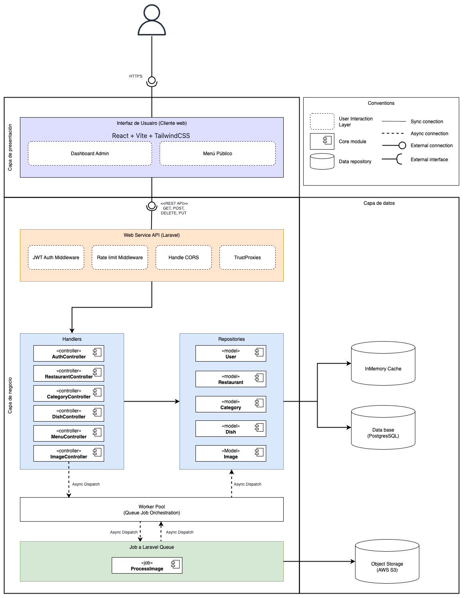

# 📘 Documentación Técnica --- API Menú Digital

## 1. Descripción General

Este proyecto corresponde a una **API REST desarrollada en Laravel** que
soporta una plataforma de menús digitales para restaurantes.

El sistema permite:

-   Autenticación de propietarios
-   Gestión de restaurantes
-   Gestión de categorías y platos
-   Administración de imágenes
-   Publicación de menú público
-   Generación de código QR
-   Procesamiento asíncrono de imágenes

La arquitectura está diseñada bajo principios de separación por capas,
procesamiento asíncrono y desacoplamiento de almacenamiento.

------------------------------------------------------------------------

# 🏗 2. Arquitectura del Sistema

La arquitectura está organizada en **capas bien definidas**, siguiendo
un enfoque modular y desacoplado.



------------------------------------------------------------------------

## 2.1 Capa de Presentación

**Tecnologías:** - React - Vite - TailwindCSS

### Módulos principales:

-   **Dashboard Admin**
    -   Gestión de restaurante
    -   CRUD de categorías y platos
    -   Subida de imágenes
-   **Menú Público**
    -   Vista pública del restaurante
    -   Acceso vía URL o código QR

La comunicación con el backend se realiza vía **HTTPS** mediante API
REST.

------------------------------------------------------------------------

## 2.2 Capa de Servicios (Web API)

Desarrollada en **Laravel**, expone endpoints REST:

-   GET
-   POST
-   PUT
-   DELETE

### Middlewares Implementados

-   JWT Auth Middleware → Autenticación basada en token
-   Rate Limit Middleware → Protección contra abuso
-   CORS Handling → Permite consumo desde frontend
-   TrustProxies → Manejo correcto de headers en entornos proxy

Esta capa actúa como punto central de validación y control.

------------------------------------------------------------------------

## 2.3 Capa de Negocio

### 2.3.1 Handlers (Controllers)

-   AuthController
-   RestaurantController
-   CategoryController
-   DishController
-   MenuController
-   ImageController

**Responsabilidades:**

-   Validación de requests
-   Orquestación de lógica
-   Dispatch de jobs
-   Transformación de respuestas

------------------------------------------------------------------------

### 2.3.2 Repositories / Modelos

Modelos Eloquent:

-   User
-   Restaurant
-   Category
-   Dish
-   Image

**Responsabilidades:**

-   Persistencia
-   Relaciones entre entidades
-   Query building
-   Integración con cache

------------------------------------------------------------------------

## 2.4 Capa de Datos

### Base de Datos

-   PostgreSQL

Almacena: - Usuarios - Restaurantes - Categorías - Platos - Metadata de
imágenes

------------------------------------------------------------------------

### Cache en Memoria

-   InMemory Cache (ej: Redis)

Usado para: - Optimizar lecturas frecuentes - Reducir carga a base de
datos - Mejorar tiempo de respuesta del menú público

------------------------------------------------------------------------

### Object Storage

-   AWS S3

Se utiliza para almacenar: - Imágenes originales - Versiones
optimizadas - Recursos estáticos

Permite: - Escalabilidad - Desacoplamiento de la aplicación - Reducción
de carga en servidor

------------------------------------------------------------------------

## 2.5 Procesamiento Asíncrono

El sistema implementa procesamiento asíncrono usando:

-   Laravel Queues
-   Worker Pool

### Flujo:

1.  El usuario sube una imagen.
2.  ImageController despacha un Job.
3.  El Worker Pool procesa el Job.
4.  El Job `ProcessImage`:
    -   Optimiza la imagen
    -   Convierte formatos si es necesario
    -   Sube el resultado a S3
    -   Actualiza metadata en DB

Este enfoque:

-   Reduce latencia en requests HTTP
-   Mejora experiencia del usuario
-   Permite escalabilidad horizontal

------------------------------------------------------------------------

## 🔄 Comunicación

  Tipo       Uso
  ---------- ---------------------
  Sync       Frontend → API
  Async      Controllers → Queue
  External   API → S3

------------------------------------------------------------------------

## 🧠 Principios Arquitectónicos Aplicados

-   Separación por capas
-   Desacoplamiento de almacenamiento
-   Procesamiento asíncrono
-   Stateless API
-   Escalabilidad horizontal
-   Seguridad basada en JWT
-   Uso de cache para performance

------------------------------------------------------------------------

## 📈 Escalabilidad

El sistema permite escalar:

-   Horizontalmente la API
-   Independientemente los workers
-   El almacenamiento mediante S3
-   La base de datos mediante replicas

------------------------------------------------------------------------

## 🔐 Seguridad

-   Autenticación JWT
-   Rate limiting
-   Validación de input
-   CORS controlado
-   Protección de rutas administrativas

------------------------------------------------------------------------

## 🧩 Resumen Arquitectónico

Frontend (React)\
⬇\
API REST (Laravel)\
⬇\
Capa de Negocio\
⬇\
Persistencia + Cache\
⬇\
Procesamiento Asíncrono\
⬇\
Object Storage (S3)


## Instalación y Configuración

### Pasos de Inicio

Para iniciar el proyecto, siga los siguientes pasos:

1. Clone el repositorio:
    ```bash
    git clone [REPOSITORY_URL]
    ```

2. Navegue al directorio del proyecto:
    ```bash
    cd p1-menu-digital-api
    ```

3. Instale las dependencias:
    ```bash
    composer install
    ```

4. Copie el archivo `.env.example` a `.env`:
    ```bash
    cp .env.example .env
    ```

5. Genere la clave de la aplicación:
    ```bash
    php artisan key:generate
    ```

6. Configure la base de datos en el archivo `.env` y ejecute las migraciones:
    ```bash
    php artisan migrate
    ```

7. Instale Passport y genere las claves de encriptación:
    ```bash
    php artisan passport:client --personal  
    ```

8. Cree las claves de Passport:
    ```bash
    php artisan passport:keys    
    ```

9. Inicie el servidor de desarrollo:
    ```bash
    php artisan serve
    ```

## API - Especificación de Endpoints

### Autenticación

#### POST `/api/v1/auth/register`
Registra un nuevo usuario en el sistema.

```bash
curl --location '[URL_PROJECT]/api/v1/auth/register' \
--header 'Accept: application/json' \
--header 'Content-Type: application/json' \
--data-raw '{
    "name": "Andres",
    "email": "andres@gmail.com",
    "password": "Andres"
}'
```

#### POST `/api/v1/auth/login`
Autentica un usuario existente.

```bash
curl --location '[URL_PROJECT]/api/v1/auth/login' \
--header 'Content-Type: application/json' \
--data-raw '{
    "email": "andres@gmail.com",
    "password": "Andres"
}'
```

#### GET `/api/v1/me`
Obtiene la información completa del usuario autenticado.

```bash
curl --location '[URL_PROJECT]/api/v1/me' \
--header 'Accept: application/json' \
--header 'Authorization: Bearer [TOKEN]'
```

### Restaurantes

#### GET `/api/v1/admin/restaurant/`
Obtiene todos los restaurantes del usuario autenticado.

```bash
curl --location '[URL_PROJECT]/api/v1/admin/restaurant/' \
--header 'Accept: application/json' \
--header 'Authorization: Bearer [TOKEN]' \
--data ''
```

#### GET `/api/v1/admin/restaurant/:id`
Obtiene los detalles de un restaurante específico.

```bash
curl --location '[URL_PROJECT]/api/v1/admin/restaurant/35899fe3-aaba-49f3-be22-867ef5b09d82' \
--header 'Accept: application/json' \
--data ''
```

#### POST `/api/v1/admin/restaurant`
Crea un nuevo restaurante.

```bash
curl --location '[URL_PROJECT]/api/v1/admin/restaurant' \
--header 'Accept: application/json' \
--header 'Content-Type: application/json' \
--header 'Authorization: Bearer [TOKEN]' \
--data '{
    "name": "Restaurante de Andres",
    "description": "Descripción del restaurante de Andres",
    "phone": "3412345678",
    "address": "Calle Falsa 123",
    "hours": {
        "monday": [
            { "open": "08:00", "close": "12:00" },
            { "open": "14:00", "close": "17:00" }
        ],
        "tuesday": [
            { "open": "08:00", "close": "18:00" }
        ],
        "sunday": []
    },
    "logo": "https://example.com/logo.png"
}'
```

#### PUT `/api/v1/admin/restaurant/:id`
Actualiza la información de un restaurante existente.

```bash
curl --location --request PUT '[URL_PROJECT]/api/v1/admin/restaurant/:id' \
--header 'Accept: application/json' \
--header 'Content-Type: application/json' \
--header 'Authorization: Bearer [TOKEN]' \
--data '{
    "name": "Restaurante de Andres",
    "description": "Descripción del restaurante de Andres",
    "phone": "3412345678",
    "address": "Calle Falsa 123",
    "hours": {
        "monday": [
            { "open": "08:00", "close": "12:00" },
            { "open": "14:00", "close": "17:00" }
        ],
        "tuesday": [
            { "open": "08:00", "close": "18:00" }
        ],
        "sunday": []
    },
    "logo": "https://example.com/logo.png"
}'
```

#### DELETE `/api/v1/admin/restaurant/:id`
Elimina un restaurante del sistema.

```bash
curl --location --request DELETE '[URL_PROJECT]/api/v1/admin/restaurant/:id' \
--header 'Accept: application/json' \
--header 'Content-Type: application/json' \
--header 'Authorization: Bearer [TOKEN]'
```

### Categorías

#### GET `/api/v1/admin/categories`
Obtiene todas las categorías.

```bash
curl --location '[URL_PROJECT]/api/v1/admin/categories' \
--header 'Accept: application/json' \
--header 'Authorization: Bearer [TOKEN]'
```

#### POST `/api/v1/admin/categories`
Crea una nueva categoría.

```bash
curl --location '[URL_PROJECT]/api/v1/admin/categories' \
--header 'Accept: application/json' \
--header 'Content-Type: application/json' \
--header 'Authorization: Bearer [TOKEN]' \
--data '{
    "name": "Categoría 2",
    "description": "Descripción de la categoría",
    "position": 2,
    "active": true
}'
```

#### PUT `/api/v1/admin/categories/:id`
Actualiza una categoría existente.

```bash
curl --location --request PUT '[URL_PROJECT]/api/v1/admin/categories/cd5a296f-0f25-47c6-b83b-110ae4815fae' \
--header 'Accept: application/json' \
--header 'Content-Type: application/json' \
--header 'Authorization: Bearer [TOKEN]' \
--data '{
    "name": "Categoría 4",
    "description": "Descripción de la categoría",
    "position": 1,
    "active": true
}'
```

#### DELETE `/api/v1/admin/categories/:id`
Elimina una categoría del sistema.

```bash
curl --location --request DELETE '[URL_PROJECT]/api/v1/admin/categories/c0e14916-02a3-4a4f-bbc8-ccb5ce4d1e40' \
--header 'Accept: application/json' \
--header 'Content-Type: application/json' \
--header 'Authorization: Bearer [TOKEN]'
```

#### PATCH `/api/v1/admin/categories/reorder`
Reordena las categorías según la posición especificada.

```bash
curl --location --request PATCH '[URL_PROJECT]/api/v1/admin/categories/reorder' \
--header 'Accept: application/json' \
--header 'Content-Type: application/json' \
--header 'Authorization: Bearer [TOKEN]' \
--data '{
    "categories": [
        {
            "id": "0ae5318f-a797-4f58-9ab7-d553655a9bc5",
            "position": 1
        },
        {
            "id": "df889c16-7090-4684-b6b4-3da7706b9c7a",
            "position": 2
        }
    ]
}'
```

### Platos

#### GET `/api/v1/admin/dishes`
Obtiene todos los platos de una categoría específica.

```bash
curl --location --request GET '[URL_PROJECT]/api/v1/admin/dishes' \
--header 'Accept: application/json' \
--header 'Content-Type: application/json' \
--header 'Authorization: Bearer [TOKEN]' \
--data '{
    "category_id": "df889c16-7090-4684-b6b4-3da7706b9c7a"
}'
```

#### GET `/api/v1/admin/dishes/:id`
Obtiene los detalles de un plato específico.

```bash
curl --location --request GET '[URL_PROJECT]/api/v1/admin/dishes/1d6fa306-17b7-4d92-9c21-0d8a5544fb15' \
--header 'Accept: application/json' \
--header 'Content-Type: application/json' \
--header 'Authorization: Bearer [TOKEN]'
```

#### POST `/api/v1/admin/dishes`
Crea un nuevo plato.

```bash
curl --location '[URL_PROJECT]/api/v1/admin/dishes' \
--header 'Accept: application/json' \
--header 'Content-Type: application/json' \
--header 'Authorization: Bearer [TOKEN]' \
--data '{
  "name": "Hamburguesa Angus Especial",
  "description": "Hamburguesa de carne Angus 200g con queso cheddar, tocineta crujiente y salsa de la casa.",
  "price": 32000,
  "offer_price": 28000,
  "image_url": "https://mirestaurante.com/images/hamburguesa-angus.jpg",
  "available": true,
  "featured": true,
  "tags": ["carne", "popular", "sin gluten"],
  "position": 1,
  "category_id": "df889c16-7090-4684-b6b4-3da7706b9c7a"
}'
```

#### PUT `/api/v1/admin/dishes/:id`
Actualiza la información de un plato existente.

```bash
curl --location --request PUT '[URL_PROJECT]/api/v1/admin/dishes/8fded667-9a12-445f-bdc0-e8ff1898a1fc' \
--header 'Accept: application/json' \
--header 'Content-Type: application/json' \
--header 'Authorization: Bearer [TOKEN]' \
--data '{
  "name": "Hamburguesa Angus Especial",
  "description": "Hamburguesa de carne Angus 200g con queso cheddar, tocineta crujiente y salsa de la casa.",
  "price": 32000,
  "offer_price": 38000,
  "image_url": "https://mirestaurante.com/images/hamburguesa-angus.jpg",
  "available": true,
  "featured": true,
  "tags": ["carne", "popular", "sin gluten"],
  "position": 1,
  "category_id": "df889c16-7090-4684-b6b4-3da7706b9c7a"
}'
```

#### DELETE `/api/v1/admin/dishes/:id`
Elimina un plato del sistema.

```bash
curl --location --request DELETE '[URL_PROJECT]/api/v1/admin/dishes/f6645e59-75d4-4638-bdc6-f3bc4ee24d19' \
--header 'Accept: application/json' \
--header 'Content-Type: application/json' \
--header 'Authorization: Bearer [TOKEN]'
```

#### PATCH `/api/v1/admin/dishes/:id/availability`
Modifica la disponibilidad de un plato.

```bash
curl --location --request PATCH '[URL_PROJECT]/api/v1/admin/dishes/1d6fa306-17b7-4d92-9c21-0d8a5544fb15/availability' \
--header 'Accept: application/json' \
--header 'Content-Type: application/json' \
--header 'Authorization: Bearer [TOKEN]' \
--data '{
  "available": true
}'
```

## Licencia

Laravel es un software de código abierto licenciado bajo la [licencia MIT](https://opensource.org/licenses/MIT).

